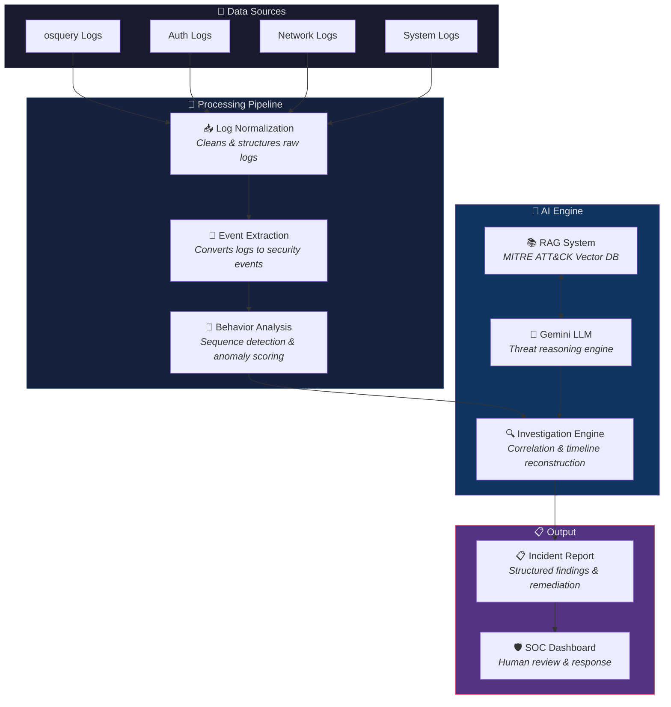

<div align="center">

# 🛡️ LLM-Powered SOC Analyst

<br>

**Autonomous Security Investigation powered by Gemini LLM, Behavioral Analysis & RAG**

<br>

[](https://www.python.org/)
[](https://fastapi.tiangolo.com/)
[](https://ai.google.dev/)
[](https://www.trychroma.com/)
[](https://www.langchain.com/)
[](https://attack.mitre.org/)

<br>

[](#)
[](#-license)
[](#-contributing)
[](https://github.com/akash4426/LLM_Powered_SOC_ANALYST/stargazers)
[](https://github.com/akash4426/LLM_Powered_SOC_ANALYST/network/members)
[](https://github.com/akash4426/LLM_Powered_SOC_ANALYST/issues)

<br>


<br>

> _"Transforming raw security logs into actionable intelligence — autonomously."_

<br>

[🚀 Quick Start](#-quick-start) •
[📖 Documentation](#-overview) •
[🏗️ Architecture](#-system-architecture) •
[📡 API Reference](#-api-reference) •
[🤝 Contributing](#-contributing)

</div>

<br>

## 📑 Table of Contents

<details open>
<summary><b>Click to expand / collapse</b></summary>

- [📖 Overview](#-overview)
- [🚨 Problem Statement](#-problem-statement)
- [✅ Solution](#-solution)
- [✨ Key Features](#-key-features)
- [🏗️ System Architecture](#-system-architecture)
- [🔄 System Workflow](#-system-workflow)
- [📂 Project Structure](#-project-structure)
- [⚙️ Component Deep Dive](#%EF%B8%8F-component-deep-dive)
- [🚀 Quick Start](#-quick-start)
- [📡 API Reference](#-api-reference)
- [📊 Example Investigation](#-example-investigation)
- [🛠️ Tech Stack](#%EF%B8%8F-tech-stack)
- [⚙️ System Requirements](#%EF%B8%8F-system-requirements)
- [🗺️ Roadmap](#%EF%B8%8F-roadmap)
- [🤝 Contributing](#-contributing)
- [📄 License](#-license)
- [📧 Contact](#-contact)

</details>

<br>

## 📖 Overview

**LLM-Powered SOC Analyst** is an AI-driven cybersecurity investigation system that automates security log analysis and attack timeline reconstruction.

Traditional SIEM platforms like Splunk generate alerts but still require human analysts to manually investigate incidents. This project introduces an **autonomous investigation pipeline** that:

```
📥 Ingests raw logs → 🔍 Extracts events → 🧠 Analyzes behavior → 📚 Retrieves threat intel → 🤖 Investigates with AI → 📋 Generates reports
```

<table>
<tr>
<td width="50%">

### 🎯 What It Does

- Processes raw security logs from multiple sources
- Extracts and correlates security events
- Retrieves relevant MITRE ATT&CK intelligence via RAG
- Generates structured incident reports with Gemini LLM
- Provides severity scores and remediation recommendations

</td>
<td width="50%">

### 💡 Why It Matters

- **80% faster** investigation compared to manual analysis
- Reduces alert fatigue with intelligent prioritization
- Maps threats to MITRE ATT&CK automatically
- Provides explainable AI reasoning for every finding
- Enables human-in-the-loop validation

</td>
</tr>
</table>

<br>

## 🚨 Problem Statement

Security Operations Centers face critical challenges that impede effective threat response:

<table>
<tr>
<td align="center" width="20%">
<br>
<h3>📊</h3>
<b>Massive Log Volumes</b>
<br><br>
<sub>Security infrastructure generates enormous volumes of logs that overwhelm analysts</sub>
<br><br>
</td>
<td align="center" width="20%">
<br>
<h3>⚠️</h3>
<b>High False Positives</b>
<br><br>
<sub>Alert fatigue from false positives reduces analyst efficiency and morale</sub>
<br><br>
</td>
<td align="center" width="20%">
<br>
<h3>🔍</h3>
<b>Manual Investigation</b>
<br><br>
<sub>SOC analysts spend significant time manually correlating events across tools</sub>
<br><br>
</td>
<td align="center" width="20%">
<br>
<h3>⏱️</h3>
<b>Slow Response</b>
<br><br>
<sub>Delayed investigations increase risk exposure and potential damage</sub>
<br><br>
</td>
<td align="center" width="20%">
<br>
<h3>🧠</h3>
<b>Knowledge Gap</b>
<br><br>
<sub>Analysts must manually map threats to MITRE ATT&CK frameworks</sub>
<br><br>
</td>
</tr>
</table>

<br>

## ✅ Solution

This system automates the full SOC investigation lifecycle using AI:

<table>
<tr>
<td>

```
✅ Log ingestion & normalization
✅ Security event extraction
✅ Behavioral sequence analysis
✅ MITRE ATT&CK threat retrieval (RAG)
✅ LLM-powered investigation (Gemini)
✅ Automated incident reporting
```

</td>
<td>

```
                ┌─────────────┐
  Raw Logs ───▶ │  AI Engine   │ ───▶ Incident Report
                │  ┌───┐ ┌───┐│
                │  │RAG│ │LLM││
                │  └───┘ └───┘│
                └─────────────┘
```

</td>
</tr>
</table>

<br>

## ✨ Key Features

<table>
<tr>
<td align="center" width="33%">
<h3>🤖</h3>
<b>Autonomous Investigation</b>
<br>
<sub>AI-driven security log analysis without manual prompting</sub>
</td>
<td align="center" width="33%">
<h3>📚</h3>
<b>RAG Knowledge Base</b>
<br>
<sub>Grounded in MITRE ATT&CK enterprise techniques via vector search</sub>
</td>
<td align="center" width="33%">
<h3>🔍</h3>
<b>Behavioral Analysis</b>
<br>
<sub>Detects suspicious event sequences and attack patterns</sub>
</td>
</tr>
<tr>
<td align="center" width="33%">
<h3>🎯</h3>
<b>Threat Mapping</b>
<br>
<sub>Automatic mapping to MITRE ATT&CK technique IDs</sub>
</td>
<td align="center" width="33%">
<h3>⏳</h3>
<b>Timeline Reconstruction</b>
<br>
<sub>Reconstructs full attack chains from log sequences</sub>
</td>
<td align="center" width="33%">
<h3>📄</h3>
<b>Structured Reports</b>
<br>
<sub>Actionable incident reports with severity and confidence scores</sub>
</td>
</tr>
<tr>
<td align="center" width="33%">
<h3>📊</h3>
<b>Confidence Scoring</b>
<br>
<sub>Quantified severity levels and confidence metrics</sub>
</td>
<td align="center" width="33%">
<h3>💡</h3>
<b>Explainable AI</b>
<br>
<sub>Transparent reasoning chains for every investigation</sub>
</td>
<td align="center" width="33%">
<h3>👥</h3>
<b>Human-in-the-Loop</b>
<br>
<sub>SOC analysts review and validate AI findings</sub>
</td>
</tr>
</table>

<br>

## 🏗️ System Architecture



<br>

## 🔄 System Workflow

```mermaid
flowchart LR
    A["🔐 Security\nLogs"] --> B["📥 Ingest &\nNormalize"]
    B --> C["🔄 Extract\nEvents"]
    C --> D["🧠 Analyze\nBehavior"]
    D --> E["📚 RAG\nRetrieval"]
    E --> F["🤖 LLM\nInvestigation"]
    F --> G["📋 Generate\nReport"]
    G --> H["🛡️ SOC\nReview"]

    style A fill:#e74c3c,stroke:#c0392b,color:#fff
    style B fill:#e67e22,stroke:#d35400,color:#fff
    style C fill:#f39c12,stroke:#e67e22,color:#fff
    style D fill:#2ecc71,stroke:#27ae60,color:#fff
    style E fill:#3498db,stroke:#2980b9,color:#fff
    style F fill:#9b59b6,stroke:#8e44ad,color:#fff
    style G fill:#1abc9c,stroke:#16a085,color:#fff
    style H fill:#34495e,stroke:#2c3e50,color:#fff
```



<br>

## 📂 Project Structure

```
LLM_Powered_SOC_ANALYST/
│
├── 📁 backend/                    # Core application code
│   ├── __init__.py               # Package initialization
│   ├── main.py                   # FastAPI server & route definitions
│   ├── models.py                 # Pydantic request/response schemas
│   ├── llm_agent.py              # Gemini LLM agent with RAG integration
│   ├── gemini_agent.py           # Standalone Gemini analysis module
│   ├── rag_engine.py             # RAG retrieval from MITRE vector DB
│   ├── log_parser.py             # Log parsing & normalization utilities
│   └── build_mitre_db.py         # Script to build MITRE ATT&CK vector DB
│
├── 📁 data/
│   └── enterprise-attack.json    # MITRE ATT&CK Enterprise dataset (STIX 2.1)
│
├── 📁 vector_db/                  # ChromaDB persistent vector store
│   └── <collection>/             # Embedded MITRE technique vectors
│
├── 📄 requirements.txt           # Python dependencies
├── 📄 readme.md                  # Project documentation (you are here!)
└── 📄 .gitignore                 # Git ignore rules
```

<br>

## ⚙️ Component Deep Dive

<details>
<summary><b>📡 Log Ingestion Layer</b></summary>

<br>

Collects raw telemetry from multiple security data sources:

| Source | Description |
|:-------|:------------|
| **osquery** | Endpoint visibility and host-based monitoring |
| **Authentication** | Login attempts, privilege changes, session events |
| **Process Execution** | Command-line activity, binary execution paths |
| **Network Activity** | Connections, DNS queries, data transfers |

</details>

<details>
<summary><b>📥 Log Normalization Layer</b></summary>

<br>

Converts heterogeneous log formats into a structured, unified schema.

**Before** (raw log):
```
cmdline: sudo su
path: /usr/bin/sudo
```

**After** (normalized event):
```
privilege_escalation_attempt
```

</details>

<details>
<summary><b>🔄 Event Extraction Engine</b></summary>

<br>

Transforms normalized logs into meaningful security events:

| Raw Activity | Extracted Event | MITRE Category |
|:-------------|:----------------|:---------------|
| `sudo` command | Privilege Escalation | TA0004 |
| Execution from `/tmp` | Suspicious Execution | TA0002 |
| Outbound connection | Command & Control | TA0011 |

</details>

<details>
<summary><b>🧠 Behavior Analysis Layer</b></summary>

<br>

Analyzes sequences of events to detect multi-stage attack patterns:

```
Login → Privilege Escalation → Suspicious Execution → External Connection
```

Supported analysis methods:
- **Rule-based** sequence pattern matching
- **LSTM** neural network sequence detection _(optional)_
- **Anomaly detection** for unusual behavioral patterns

</details>

<details>
<summary><b>📚 RAG Knowledge Base</b></summary>

<br>

Retrieval-Augmented Generation grounds the LLM in cybersecurity knowledge:

| Component | Technology | Purpose |
|:----------|:-----------|:--------|
| Dataset | MITRE ATT&CK Enterprise | Threat technique knowledge |
| Embeddings | Sentence-Transformers (all-MiniLM-L6-v2) | Semantic vectorization |
| Vector Store | ChromaDB | Persistent similarity search |
| Retrieval | LangChain | Top-k semantic retrieval |

</details>

<details>
<summary><b>🤖 Gemini LLM Agent</b></summary>

<br>

The Gemini 2.5 Flash model performs investigation by:

- 🔍 Analyzing event sequences for attack indicators
- 🎯 Mapping events to specific MITRE ATT&CK technique IDs
- 🔗 Reconstructing full attack chains with temporal ordering
- 💡 Generating explainable analysis with reasoning chains

</details>

<details>
<summary><b>📋 Incident Report Generator</b></summary>

<br>

Produces structured investigation output:

```
┌─────────────────────────────────┐
│       INCIDENT REPORT           │
├─────────────────────────────────┤
│ ⚔️  Attack Stage                │
│ 🎯 MITRE ATT&CK Techniques     │
│ 🔴 Severity Level               │
│ 📊 Confidence Score             │
│ 💡 Explanation                   │
│ 🛠️  Remediation Recommendations │
└─────────────────────────────────┘
```

</details>

<br>

## 🚀 Quick Start

Get up and running in under 5 minutes:

### Prerequisites

- **Python 3.10+** — [Download](https://www.python.org/downloads/)
- **Git** — [Download](https://git-scm.com/)
- **Gemini API Key** — [Get one free](https://aistudio.google.com/apikey)

### 1️⃣ Clone & Setup

```bash
# Clone the repository
git clone https://github.com/akash4426/LLM_Powered_SOC_Analyst.git
cd LLM_Powered_SOC_Analyst

# Create & activate virtual environment
python3 -m venv venv
source venv/bin/activate        # Linux / macOS
# venv\Scripts\activate         # Windows
```

### 2️⃣ Install Dependencies

```bash
pip install -r requirements.txt
```

### 3️⃣ Configure Environment

```bash
# Create .env file with your Gemini API key
echo "GEMINI_API_KEY=your_api_key_here" > .env
```

### 4️⃣ Launch the Server

```bash
uvicorn backend.main:app --reload
```

### 5️⃣ Test It Out

```bash
# Health check
curl http://127.0.0.1:8000/

# Run an investigation
curl -X POST http://127.0.0.1:8000/investigate \
  -H "Content-Type: application/json" \
  -d '{"logs": "User login from 10.0.0.5\nsudo command executed\nbinary executed from /tmp\noutbound connection to external IP"}'
```

> 💡 **Interactive Docs**: Visit [http://127.0.0.1:8000/docs](http://127.0.0.1:8000/docs) for the Swagger UI

<br>

## 📡 API Reference

### `GET /`

Health check endpoint.

```bash
curl http://127.0.0.1:8000/
```

<details>
<summary><b>📤 Response</b></summary>

```json
{
  "status": "SOC Analyst API running"
}
```

</details>

---

### `POST /investigate`

Submit security logs for AI-powered investigation.

```bash
curl -X POST http://127.0.0.1:8000/investigate \
  -H "Content-Type: application/json" \
  -d '{"logs": "User login from 10.0.0.5\nsudo command executed"}'
```

<details>
<summary><b>📥 Request Body</b></summary>

| Field | Type | Required | Description |
|:------|:-----|:---------|:------------|
| `logs` | `string` | ✅ | Raw security log text (newline-separated) |

```json
{
  "logs": "User login from 10.0.0.5\nsudo command executed\nbinary executed from /tmp"
}
```

</details>

<details>
<summary><b>📤 Response</b></summary>

```json
{
  "logs": "User login from 10.0.0.5\nsudo command executed\nbinary executed from /tmp",
  "investigation": "**Attack Chain:** Initial Access → Privilege Escalation → Execution\n\n**MITRE Techniques:** T1078, T1068, T1059\n\n**Severity:** High\n**Confidence:** 0.92\n\n**Recommended Actions:**\n- Isolate the affected host\n- Rotate compromised credentials\n- Investigate lateral movement"
}
```

</details>

<br>

## 📊 Example Investigation

<table>
<tr>
<td width="50%">

### 📥 Input Logs

```
User login from 10.0.0.5
sudo command executed
binary executed from /tmp
outbound connection to external IP
```

</td>
<td width="50%">

### 📋 AI-Generated Report

```
🔗 Attack Chain:
   Initial Access → Privilege Escalation
   → Execution → Command & Control

🎯 MITRE Techniques:
   T1078, T1068, T1059, T1071

🔴 Severity: High
📊 Confidence: 0.92

🛠️ Recommended Actions:
   • Isolate host immediately
   • Rotate credentials
   • Investigate lateral movement
```

</td>
</tr>
</table>

<br>

## 🛠️ Tech Stack

<table>
<tr>
<th align="left">Category</th>
<th align="left">Technology</th>
<th align="left">Version</th>
<th align="left">Purpose</th>
</tr>
<tr>
<td><b>🌐 Framework</b></td>
<td>FastAPI</td>
<td><code>0.110.0</code></td>
<td>REST API server</td>
</tr>
<tr>
<td><b>🤖 LLM</b></td>
<td>Google Gemini</td>
<td><code>2.5 Flash</code></td>
<td>AI reasoning engine</td>
</tr>
<tr>
<td><b>🔗 Orchestration</b></td>
<td>LangChain</td>
<td><code>0.2.1</code></td>
<td>RAG pipeline orchestration</td>
</tr>
<tr>
<td><b>🗄️ Vector DB</b></td>
<td>ChromaDB</td>
<td><code>0.5.0</code></td>
<td>Persistent vector storage</td>
</tr>
<tr>
<td><b>📐 Embeddings</b></td>
<td>Sentence-Transformers</td>
<td><code>2.7.0</code></td>
<td>Semantic text embeddings</td>
</tr>
<tr>
<td><b>🛡️ Threat Intel</b></td>
<td>MITRE ATT&CK</td>
<td><code>Enterprise</code></td>
<td>Technique knowledge base</td>
</tr>
<tr>
<td><b>📊 Data</b></td>
<td>Pandas / NumPy</td>
<td><code>2.2 / 1.26</code></td>
<td>Data processing</td>
</tr>
<tr>
<td><b>🎨 CLI</b></td>
<td>Rich</td>
<td><code>13.7.1</code></td>
<td>Terminal formatting</td>
</tr>
</table>

<br>

## ⚙️ System Requirements

<table>
<tr>
<th></th>
<th align="center">⚡ Minimum</th>
<th align="center">🚀 Recommended</th>
</tr>
<tr>
<td><b>CPU</b></td>
<td align="center">4 cores</td>
<td align="center">8+ cores</td>
</tr>
<tr>
<td><b>RAM</b></td>
<td align="center">8 GB</td>
<td align="center">16 GB</td>
</tr>
<tr>
<td><b>Storage</b></td>
<td align="center">5 GB</td>
<td align="center">10 GB</td>
</tr>
<tr>
<td><b>Python</b></td>
<td align="center">3.10</td>
<td align="center">3.11+</td>
</tr>
</table>

<br>

## 🗺️ Roadmap

- [x] Core investigation pipeline with Gemini LLM
- [x] RAG integration with MITRE ATT&CK knowledge base
- [x] FastAPI REST API with Swagger documentation
- [x] ChromaDB vector store with persistent embeddings
- [ ] Frontend SOC analyst dashboard (React)
- [ ] LSTM-based behavioral sequence detection
- [ ] Multi-log source ingestion (Splunk, Elastic)
- [ ] Real-time log streaming support
- [ ] Role-based access control (RBAC)
- [ ] Investigation history and audit trail
- [ ] Export reports (PDF / JSON / STIX)
- [ ] Docker containerization & Helm charts

<br>

## 🤝 Contributing

Contributions are welcome and greatly appreciated! Here's how you can help:

<details>
<summary><b>📝 Contribution Guide</b></summary>

<br>

1. **Fork** the repository
2. **Create** your feature branch
   ```bash
   git checkout -b feature/amazing-feature
   ```
3. **Commit** your changes
   ```bash
   git commit -m "feat: add amazing feature"
   ```
4. **Push** to the branch
   ```bash
   git push origin feature/amazing-feature
   ```
5. **Open** a Pull Request

#### Commit Convention

| Prefix | Usage |
|:-------|:------|
| `feat:` | New feature |
| `fix:` | Bug fix |
| `docs:` | Documentation |
| `refactor:` | Code refactoring |
| `test:` | Adding tests |

</details>

<br>

## 📄 License

This project is licensed under the **MIT License** — see the [LICENSE](LICENSE) file for details.

<br>

## 📧 Contact

<table>
<tr>
<td align="center">
<b>Akash</b>
<br><br>
<a href="https://github.com/akash4426">

</a>
</td>
</tr>
</table>

<br>

---

<div align="center">

### ⭐ Star This Repository

**If this project helped you, consider giving it a star — it helps others discover it!**

<br>

[](https://star-history.com/#akash4426/LLM_Powered_SOC_ANALYST&Date)

<br>

```
🛡️ AI + Cybersecurity + LLM Reasoning = Autonomous SOC Analyst
```

<br>

Made with ❤️ by [Akash](https://github.com/akash4426)

<sub>Built with Gemini LLM • LangChain • MITRE ATT&CK • FastAPI • ChromaDB</sub>

</div>
