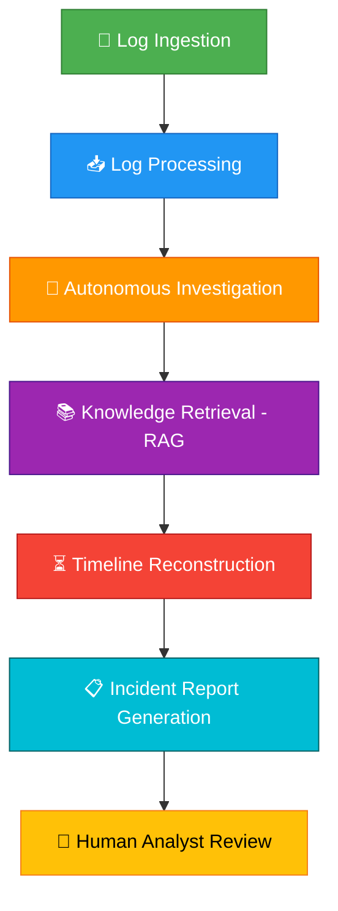

# 🛡️ LLM-Powered SOC Analyst

<div align="center">

### Autonomous Security Investigation using Gemini LLM and Retrieval-Augmented Generation (RAG)


</div>

---

## 📖 Overview

**LLM-Powered SOC Analyst** is an autonomous cybersecurity investigation system that leverages Large Language Models (Gemini) to analyze security logs, reconstruct attack timelines, and map threats to the **MITRE ATT&CK** framework.

Traditional SIEM tools like Splunk generate alerts but require human analysts to investigate. This system performs **autonomous investigation**, reasoning over complete attack sequences and providing actionable intelligence.

---

## Problem Statement

<table>
<tr>
<td width="50%">

### Challenges in Security Operations Centers

- 📊 **Massive volumes** of security logs
- ⚠️ **High false positive** rates
- 🔍 **Manual investigation** workload
- 😰 **Alert fatigue** among analysts
- ⏱️ **Slow incident response** times

</td>
<td width="50%">

### Our Solution

✅ **LLM-powered reasoning** over security events  
✅ **Autonomous investigation** capabilities  
✅ **RAG-based knowledge** grounding  
✅ **MITRE ATT&CK** technique mapping  
✅ **Explainable AI** security analysis  

</td>
</tr>
</table>

---

##  Key Features

<div align="center">

| Feature | Description |
|---------|-------------|
| 🤖 **Autonomous Investigation** | Gemini LLM analyzes security logs without human intervention |
| 📚 **RAG Knowledge Base** | Grounds analysis in MITRE ATT&CK framework |
| 🎯 **Threat Mapping** | Automatically maps threats to MITRE techniques |
| ⏳ **Timeline Reconstruction** | Reconstructs complete attack sequences |
| 📄 **Structured Reports** | Generates comprehensive incident reports |
| 📊 **Confidence Scoring** | Provides severity classification and confidence levels |
| 💡 **Explainable AI** | Transparent reasoning for security decisions |
| 👥 **Human-in-the-Loop** | Supports analyst decision-making |

</div>

---

## Architecture

<div align="center">

```
┌─────────────────────────────────────────────────────────────────────────┐
│                           🛡️ SOC ANALYST INTERFACE                      │
│                     (Human Review & Response Actions)                   │
└────────────────────────────────┬────────────────────────────────────────┘
                                 │
┌────────────────────────────────▼────────────────────────────────────────┐
│                      📋 INCIDENT REPORT GENERATOR                       │
│         (Attack Stage, MITRE Mapping, Severity, Remediation)            │
└────────────────────────────────┬────────────────────────────────────────┘
                                 │
┌────────────────────────────────▼────────────────────────────────────────┐
│                       🔍 INVESTIGATION ENGINE                           │
│         (Timeline Reconstruction, Event Correlation, Analysis)          │
└─────────────┬───────────────────────────────────────┬────────────────────┘
              │                                       │
┌─────────────▼──────────────┐          ┌────────────▼──────────────────┐
│   🤖 GEMINI LLM AGENT      │          │    📚 RAG KNOWLEDGE BASE      │
│  (Reasoning & Analysis)    │◄────────►│  (MITRE ATT&CK + ChromaDB)   │
└─────────────┬──────────────┘          └───────────────────────────────┘
              │
┌─────────────▼──────────────────────────────────────────────────────────┐
│                      ⚡ FASTAPI ORCHESTRATOR                            │
│              (Central Controller & Processing Coordinator)              │
└─────────────┬──────────────────────────────────────────────────────────┘
              │
┌─────────────▼──────────────────────────────────────────────────────────┐
│                      📥 LOG INGESTION LAYER                             │
│           (Collection, Cleaning, Normalization, Structuring)            │
└─────────────┬──────────────────────────────────────────────────────────┘
              │
┌─────────────▼──────────────────────────────────────────────────────────┐
│                          📡 LOG SOURCES                                 │
│         (Authentication, Process Execution, Network Activity)           │
└─────────────────────────────────────────────────────────────────────────┘
```

</div>

---

### 📦 Component Description

<details>
<summary><b>1. 📡 Log Sources</b></summary>

Provides raw security telemetry:
- 🔐 Authentication logs  
- ⚙️ Process execution logs  
- 🌐 Network activity logs  

</details>

<details>
<summary><b>2. 📥 Log Ingestion Layer</b></summary>

Responsible for:
- 📨 Collecting logs from multiple sources
- 🧹 Cleaning and normalizing data  
- 📋 Converting logs into structured format  

</details>

<details>
<summary><b>3. ⚡ FastAPI Orchestrator</b></summary>

Acts as the central controller:
- 📩 Receives logs
- 🎯 Coordinates processing
- 🤖 Calls Gemini LLM agent
- 📚 Retrieves knowledge from RAG system

</details>

<details>
<summary><b>4. 🤖 Gemini LLM Agent (Reasoning Core)</b></summary>

Performs:
- 🔍 Autonomous log investigation
- 🧠 Threat reasoning and analysis
- 🎯 Attack pattern identification

</details>

<details>
<summary><b>5. 📚 RAG Knowledge Base</b></summary>

Provides grounded cybersecurity knowledge:
- 🎯 MITRE ATT&CK framework
- 🗄️ Vector database (ChromaDB)
- 🔎 Semantic retrieval

</details>

<details>
<summary><b>6. 🔍 Investigation Engine</b></summary>

Responsible for:
- ⏳ Timeline reconstruction
- 🔗 Event correlation
- 📊 Attack sequence analysis

</details>

<details>
<summary><b>7. 📋 Incident Report Generator</b></summary>

Generates structured reports:
- 🎭 Attack stage identification
- 🎯 MITRE technique mapping
- ⚠️ Severity level assessment
- 📊 Confidence score
- 💡 Recommended remediation actions

</details>

<details>
<summary><b>8. 🛡️ SOC Analyst Interface</b></summary>

Allows human analyst to:
- 📖 Review investigation results
- ✅ Validate findings
- 🚀 Take response actions

</details>

---

### ✨ Architecture Highlights

```diff
+ Modular and scalable design  
+ Agent-based investigation model  
+ LLM-powered reasoning engine  
+ Knowledge-grounded threat analysis  
+ Explainable incident reporting  
```

---

## 🔄 Project Workflow

<div align="center">



</div>

---

### 📋 Workflow Steps

| Step | Description |
|------|-------------|
| **1️⃣ Log Ingestion** | Security logs are received from authentication systems, endpoints, and network activity |
| **2️⃣ Log Processing** | Logs are cleaned, normalized, and converted into structured format |
| **3️⃣ Autonomous Investigation** | Gemini LLM analyzes logs and detects suspicious patterns |
| **4️⃣ Knowledge Retrieval (RAG)** | System retrieves MITRE ATT&CK knowledge to validate threats |
| **5️⃣ Timeline Reconstruction** | System reconstructs full attack sequence |
| **6️⃣ Incident Report Generation** | System generates structured incident report |
| **7️⃣ Human Analyst Review** | SOC analyst reviews and approves actions |

---

## ⚙️ System Requirements

### 💻 Hardware

| Component | Minimum | Recommended |
|-----------|---------|-------------|
| **CPU** | 4 cores | 8+ cores |
| **RAM** | 8 GB | 16 GB |
| **Storage** | 5 GB free | 10 GB+ free |
| **Internet** | Required | High-speed connection |

---

### 🛠️ Software

<table>
<tr>
<td>

**Required Software:**
- 🐍 Python 3.10+
- 📦 pip
- 🔧 Git
- 🌐 Virtual environment (recommended)

</td>
<td>

**Check Python Version:**
```bash
python --version
```

</td>
</tr>
</table>

---

## 🚀 Installation Guide

### 1️⃣ Clone the Repository

```bash
git clone https://github.com/akash4426/LLM_Powered_SOC_Analyst.git
cd LLM_Powered_SOC_Analyst
```

---

### 2️⃣ Create Virtual Environment

<details>
<summary><b>🪟 Windows</b></summary>

```bash
python -m venv venv
venv\Scripts\activate
```

</details>

<details>
<summary><b>🐧 Linux / macOS</b></summary>

```bash
python3 -m venv venv
source venv/bin/activate
```

</details>

---

### 3️⃣ Install Dependencies

```bash
pip install -r requirements.txt
```

## 🤝 Contributing

Contributions are welcome! Please feel free to submit a Pull Request.

---

## 📧 Contact

**Author:** Akash  
**GitHub:** [@akash4426](https://github.com/akash4426)

---

<div align="center">

### ⭐ If you find this project useful, please consider giving it a star!

**Made with ❤️ by Akash**

</div>
